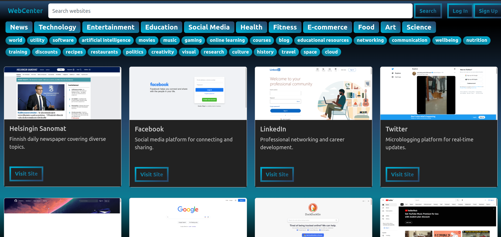
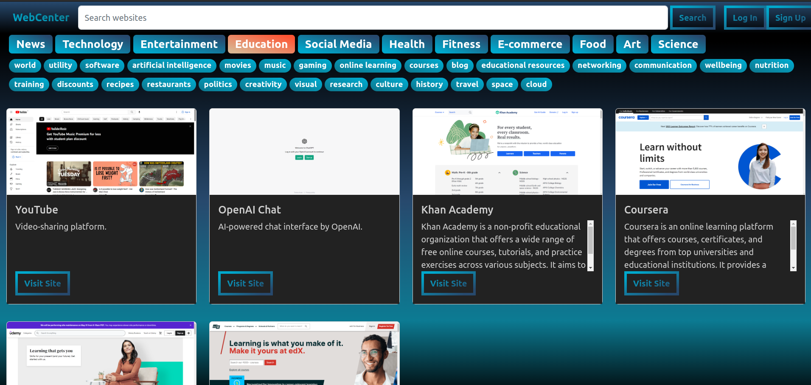
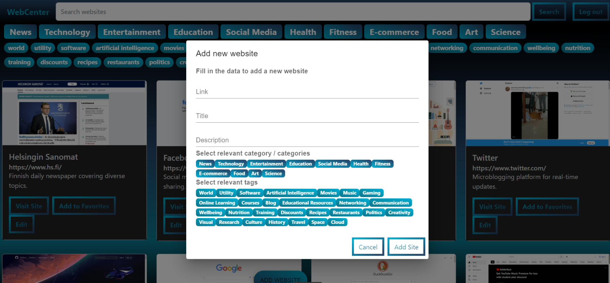

# Web-Bookmarks

WebBookmarks is a web application designed to serve as a visual bookmarking solution. This user-friendly platform allows users to store and effortlessly locate their website bookmarks. Each bookmark is presented as a card, complete with a title, a webpage screenshot, and a brief description. Users can conveniently log in to the application, utilize the powerful search functionality, and apply filters based on categories and tags to swiftly find desired websites. The admin privileges enable the management of website information, including editing existing data and adding new websites. The back-end is built with Java Spring Boot and employing a MySQL database. The front-end is developed using React, Redux, and JavaScript, with Bootstrap providing an aesthetically pleasing design.

### Main View   

The main view of WebCenter displays a collection of website cards, accompanied by categories, tags, and search functionality. Users can easily navigate through their bookmarks and access the login feature, ensuring seamless access to their favorite websites.  

  

By selecting a single category and a tag, users can instantly refine their website display, providing a tailored browsing experience. Find exactly what you're looking for with ease.  
  
In this screenshot, the 'Add New Webpage' functionality is highlighted, enabling users to effortlessly expand their bookmarked websites. Enjoy the convenience of quick and seamless updates to your collection.  
  

## Tech Stack

### Front-end

- JavaScript
- React
- React Redux
- Bootstrap

### Back-end

- Java
- Spring Boot
- MySQL

## Installation

- Clone the repository  
`git clone https://github.com/gowthampanyam/Web-Bookmarks.git`  
- start server (run in server folder)   
    `cd server` 
    `mvnw spring-boot:run`   
- Install front-end dependencies   
`cd client`  
`npm i`  
- Start React App  
`npm start`

The back-end database API is hosted on localhost:8080, and the front-end React app can be found at localhost:3000.

